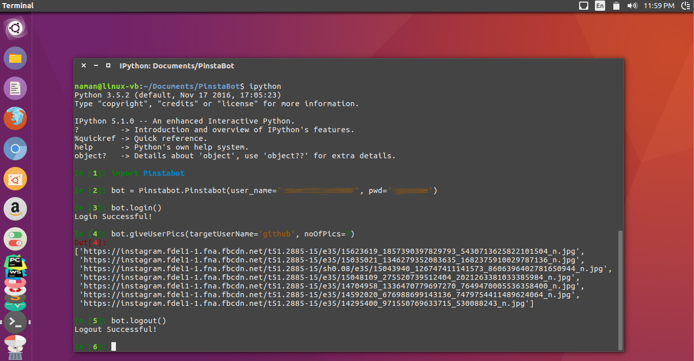

# Instagram bot
a NON-API python module(?) to get images URLs of any user, including private accounts.
Here is a simple depiction of what this can do.

Simply create an instance of the provided class. With your accounts' credentials (Yes that's required :P) and 'login()' as depicted. You get a list of of image URLs (HQ) of any public or any private account that you follow in return of 'giveUserPics()' function. 

So that's all the bot does for now. Feel free to contribute. :)
